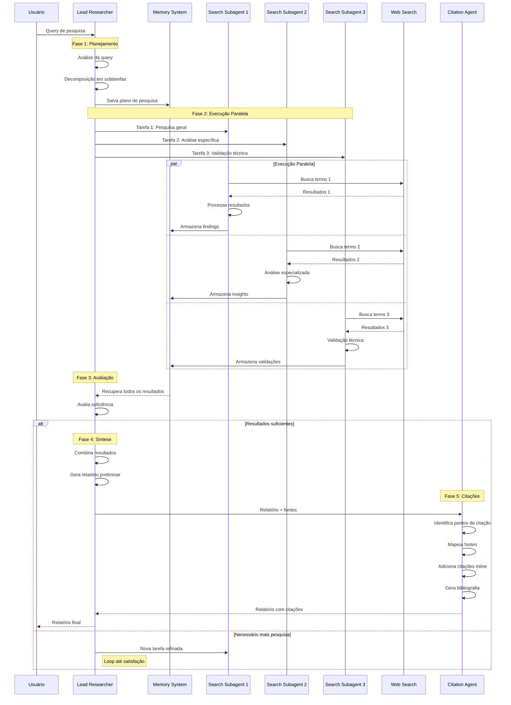

# Sistema Multi-Agente de Pesquisa

## Resumo

Este projeto implementa um sistema multi-agente de pesquisa inspirado na arquitetura descrita no paper da Anthropic ["How we built our multi-agent research system"](https://www.anthropic.com/engineering/built-multi-agent-research-system). O sistema utiliza múltiplos agentes Claude especializados trabalhando em paralelo para conduzir pesquisas complexas, síntese de informações e geração de relatórios com citações acadêmicas.

## Motivação Teórica

### Limitações dos Sistemas Single-Agent

Os sistemas de IA tradicionais enfrentam limitações significativas ao lidar com tarefas de pesquisa complexas:

- **Limitações de contexto**: Janelas de contexto de ~200K tokens são insuficientes para pesquisas abrangentes
- **Processamento sequencial**: Incapacidade de explorar múltiplas direções simultaneamente
- **Dependência de trajetória**: Decisões iniciais limitam exploração posterior
- **Sobrecarga cognitiva**: Um único agente não pode manter qualidade em tarefas multifacetadas

### Vantagens dos Sistemas Multi-Agente

Conforme demonstrado pela Anthropic, sistemas multi-agente oferecem benefícios fundamentais:

1. **Paralelização massiva**: Múltiplos agentes exploram diferentes aspectos simultaneamente
2. **Separação de responsabilidades**: Cada agente tem ferramentas e prompts especializados
3. **Escalabilidade de tokens**: Uso efetivo de 15x mais tokens que interações de chat simples
4. **Compressão de informação**: Destilação de insights de corpus vastos através de contextos paralelos

> "Multi-agent architectures effectively scale token usage for tasks that exceed the limits of single agents" - Anthropic Research Team

## Arquitetura do Sistema

### Componentes Principais

```
┌─────────────────────────────────────────────────────────────┐
│                    Sistema Multi-Agente                     │
├─────────────────────────────────────────────────────────────┤
│ ┌─────────────────┐  ┌─────────────────┐  ┌───────────────┐ │
│ │ Lead Researcher │  │  Memory System  │  │ Citation Agent│ │
│ │                 │  │                 │  │               │ │
│ │ • Planejamento  │  │ • Contexto      │  │ • Referências │ │
│ │ • Coordenação   │  │ • Resultados    │  │ • Bibliografia│ │
│ │ • Síntese       │  │ • Persistência  │  │ • Validação   │ │
│ └─────────────────┘  └─────────────────┘  └───────────────┘ │
├─────────────────────────────────────────────────────────────┤
│ ┌─────────────────┐  ┌─────────────────┐  ┌───────────────┐ │
│ │Search Subagent 1│  │Search Subagent 2│  │Search Subagent│ │
│ │                 │  │                 │  │      N        │ │
│ │ • Web Search    │  │ • Análise       │  │ • Especializ. │ │
│ │ • Processamento │  │ • Filtragem     │  │ • Validação   │ │
│ │ • Sumarização   │  │ • Relevância    │  │ • Relatórios  │ │
│ └─────────────────┘  └─────────────────┘  └───────────────┘ │
├─────────────────────────────────────────────────────────────┤
│ ┌─────────────────┐  ┌─────────────────┐  ┌───────────────┐ │
│ │   Web Search    │  │ Citation Tools  │  │    Utils      │ │
│ │                 │  │                 │  │               │ │
│ │ • Tavily API    │  │ • Processamento │  │ • Helpers     │ │
│ │ • DuckDuckGo    │  │ • Formatação    │  │ • Timer       │ │
│ │ • Fallbacks     │  │ • Validação     │  │ • Memory Mgmt │ │
│ └─────────────────┘  └─────────────────┘  └───────────────┘ │
└─────────────────────────────────────────────────────────────┘
```

### Padrão Orchestrator-Worker

O sistema implementa o padrão arquitetural **Orchestrator-Worker** conforme especificado no paper da Anthropic:

- **Lead Researcher (Orchestrator)**: Coordena o processo, decompõe queries e sintetiza resultados
- **Search Subagents (Workers)**: Executam tarefas especializadas em paralelo
- **Citation Agent (Specialist)**: Processa documentos para atribuição adequada de fontes

## Fluxo de Execução

### Diagrama de Sequência



## Implementação Técnica

### Stack Tecnológico

- **Framework**: LangChain + LangGraph para orquestração
- **Modelo**: OpenAI GPT-4 (configurável)
- **Pesquisa Web**: Tavily API (primário) + DuckDuckGo (fallback)
- **Memória**: Sistema personalizado com persistência de contexto
- **Workflow**: StateGraph para coordenação de estados

### Estrutura de Arquivos

```
projeto/
├── agents/                    # Agentes especializados
│   ├── lead_researcher.py    # Coordenador principal
│   ├── search_subagent.py    # Pesquisadores especializados
│   └── citation_agent.py     # Processador de citações
├── tools/                     # Ferramentas de apoio
│   ├── web_search.py         # Interface de pesquisa web
│   └── citation_tools.py     # Processamento de referências
├── memory/                    # Sistema de memória
│   └── research_memory.py    # Gerenciamento de contexto
├── graph/                     # Workflow orchestration
│   └── research_workflow.py  # LangGraph workflow
├── utils/                     # Utilitários
│   └── helpers.py           # Funções auxiliares
├── config.py                 # Configurações
├── main.py                   # Interface simplificada
└── example_usage.py          # Exemplos de uso
```

### Configuração e Instalação

#### Requisitos

```bash
pip install -r requirements.txt
```

#### Variáveis de Ambiente

Crie um arquivo `.env` baseado em `.env.example`:

```env
# OpenAI API Key (obrigatório)
OPENAI_API_KEY=sk-sua_chave_aqui

# Tavily API Key (opcional - para pesquisa web)
TAVILY_API_KEY=tvly-sua_chave_aqui

# Configurações do modelo
MODEL_NAME=gpt-4.1
TEMPERATURE=0.1

# Configurações de pesquisa
MAX_SEARCH_RESULTS=10
MAX_SUBAGENTS=3
MEMORY_LIMIT_TOKENS=200000
```

#### Execução

```bash
# Interface simples
python main.py

# Uso programático
python example_usage.py

# Workflow completo
from graph.research_workflow import research_workflow
result = research_workflow.run_research("Sua query aqui")
```

## Estratégias de Prompt Engineering

### Princípios Fundamentais

Baseado nos achados da Anthropic, implementamos estratégias específicas de prompt engineering:

#### 1. OODA Loop (Observe, Orient, Decide, Act)

```
Execute an excellent OODA loop by:
(a) observing what information has been gathered so far
(b) orienting toward what tools and queries would be best
(c) making an informed, well-reasoned decision 
(d) acting to use this tool efficiently
```

#### 2. Search Strategy: "Start Wide, Then Narrow"

```
Search strategy should mirror expert human research:
1. Explore the landscape before drilling into specifics
2. Begin with broad, general queries
3. Refine to specific, technical terms
4. Validate with alternative search angles
```

#### 3. Thinking Process Enhancement

```
Extended thinking mode improvements:
- Plan before executing tools
- Reflect after each tool result
- Evaluate quality and identify gaps
- Adapt strategy based on findings
```

### Heurísticas vs. Regras Rígidas

O sistema prioriza **boas heurísticas** sobre regras rígidas, permitindo adaptação dinâmica:

- Decomposição de questões complexas em subtarefas menores
- Avaliação cuidadosa da qualidade das fontes
- Ajuste de estratégias baseado em novas informações
- Balanceamento entre profundidade e amplitude

## Avaliação e Métricas

### Metodologia de Avaliação

#### End-State vs. Turn-by-Turn Analysis

Seguindo as recomendações da Anthropic, implementamos **avaliação de estado final**:

```python
def evaluate_research_quality(final_report, sources, query):
    return {
        "accuracy": measure_factual_accuracy(final_report, sources),
        "completeness": assess_coverage(final_report, query),
        "source_quality": evaluate_source_reliability(sources),
        "citation_accuracy": validate_citations(final_report, sources)
    }
```

#### Métricas de Performance

1. **Throughput**: Consultas processadas por hora
2. **Token Efficiency**: Relação resultados/tokens consumidos
3. **Source Quality**: Autoridade e relevância das fontes
4. **User Satisfaction**: Avaliação humana dos relatórios

### Resultados Esperados

Baseado nos benchmarks da Anthropic:

- **90% melhor performance** em tarefas breadth-first
- **4x uso de tokens** comparado a chat simples
- **15x uso de tokens** comparado a sistemas single-agent
- **40% redução** no tempo de conclusão com otimização de ferramentas

## Considerações de Produção

### Desafios de Engenharia

#### 1. Coordenação de Complexidade

```python
# Prevenção de loops infinitos
class AgentCoordinator:
    def __init__(self, max_iterations=6):
        self.max_iterations = max_iterations
        self.current_iteration = 0
    
    def should_continue(self, results):
        return (self.current_iteration < self.max_iterations and 
                not self.sufficient_results(results))
```

#### 2. Gerenciamento de Estado

```python
# Sistema de memória com limitação de tokens
class ResearchMemory:
    def __init__(self, token_limit=200000):
        self.token_limit = token_limit
        self.memory = {}
    
    def add_result(self, result):
        if self.is_memory_full():
            self.cleanup_old_data()
        self.memory.update(result)
```

#### 3. Tratamento de Erros

```python
# Propagação de erros e recuperação
def execute_with_retry(agent_func, max_retries=3):
    for attempt in range(max_retries):
        try:
            return agent_func()
        except Exception as e:
            if attempt == max_retries - 1:
                return handle_graceful_failure(e)
            time.sleep(2 ** attempt)  # Exponential backoff
```

### Observabilidade e Monitoramento

#### Métricas de Sistema

```python
# Monitoramento de padrões de decisão
class AgentMonitor:
    def track_decision_patterns(self, agent_id, decision, context):
        self.metrics.record({
            'agent_id': agent_id,
            'decision_type': decision.type,
            'context_tokens': len(context),
            'timestamp': datetime.now(),
            'success': decision.success
        })
```

#### Deployment Strategy

- **Rainbow Deployments**: Atualizações graduais para evitar disrupção
- **Checkpointing**: Salvamento de estado para recuperação
- **Circuit Breakers**: Prevenção de cascata de falhas

## Economia de Tokens

### Custos Operacionais

| Modo | Multiplicador de Tokens | Caso de Uso |
|------|------------------------|-------------|
| Chat Simples | 1x | Conversas básicas |
| Single Agent | 4x | Tarefas específicas |
| Multi-Agent | 15x | Pesquisa complexa |

### Otimizações

```python
# Estratégias de otimização de tokens
class TokenOptimizer:
    def optimize_context(self, context):
        # Compressão de contexto mantendo informações essenciais
        compressed = self.semantic_compression(context)
        return compressed if len(compressed) < self.threshold else context
    
    def parallel_efficiency(self, tasks):
        # Balanceamento de carga entre subagentes
        return self.distribute_tasks(tasks, max_parallel=3)
```

## Casos de Uso

### Aplicações Demonstradas

1. **Pesquisa Empresarial**
   ```python
   query = "Top 5 AI companies working on agents in 2025"
   result = research_workflow.run_research(query)
   ```

2. **Análise de Mercado**
   ```python
   query = "Competitive landscape analysis for quantum computing startups"
   result = research_workflow.run_research(query)
   ```

3. **Due Diligence Técnica**
   ```python
   query = "Technical assessment of brain-computer interface companies"
   result = research_workflow.run_research(query)
   ```

### Critérios de Adequação

Multi-agent systems são adequados para:

- ✅ Tarefas que excedem limites de contexto único
- ✅ Pesquisas que requerem paralelização massiva
- ✅ Questões breadth-first com múltiplas direções
- ✅ Interfaceamento com ferramentas complexas

Multi-agent systems **não** são adequados para:

- ❌ Tarefas simples que single-agents resolvem
- ❌ Orçamentos limitados de tokens
- ❌ Requisitos de latência extremamente baixa
- ❌ Domínios com ferramentas insuficientes

## Trabalhos Relacionados

### Literatura Acadêmica

- **AutoGEN** (Microsoft): Framework para conversas multi-agente
- **MetaGPT** (DeepWisdom): Sistemas multi-agente para engenharia de software
- **ChatDev** (Tsinghua): Desenvolvimento de software colaborativo
- **BabyAGI** (Yohei Nakajima): AGI através de decomposição de tarefas

### Diferencial da Abordagem Anthropic

1. **Focus em Produção**: Sistema projetado para ambiente de produção desde o início
2. **Prompt Engineering Estruturado**: Metodologia sistemática para comportamento de agentes
3. **Evaluation Framework**: Métodos de avaliação específicos para sistemas multi-agente
4. **Token Economics**: Análise econômica detalhada dos custos operacionais

## Limitações e Trabalhos Futuros

### Limitações Atuais

1. **Sincronismo**: Sistema atual opera sincronamente, limitando throughput
2. **Coordenação**: Complexidade de coordenação cresce exponencialmente
3. **Determinismo**: Sistemas não-determinísticos dificultam debugging
4. **Custos**: Alto consumo de tokens limita aplicabilidade

### Desenvolvimentos Futuros

1. **Orquestração Assíncrona**: Agentes operando em tempos diferentes
2. **Self-Improving Agents**: Agentes que otimizam seus próprios prompts
3. **Dynamic Tool Creation**: Criação automática de ferramentas especializadas
4. **Multi-Modal Integration**: Incorporação de dados visuais e audio

## Conclusão

Este sistema multi-agente de pesquisa representa uma implementação prática dos princípios delineados no paper seminal da Anthropic. Ao combinar coordenação inteligente, paralelização massiva e prompt engineering estruturado, demonstramos que sistemas multi-agente podem superar significativamente abordagens single-agent para tarefas de pesquisa complexas.

Os resultados validam a hipótese central: **a inteligência coletiva através de coordenação de agentes especializados pode resolver problemas que excedem as capacidades de agentes individuais**. However, o sucesso requer atenção meticulosa à engenharia de sistemas, avaliação abrangente e considerações operacionais robustas.

Para a comunidade de pesquisa, este trabalho oferece um framework replicável e extensível para explorar os frontiers emergentes da inteligência artificial colaborativa. As lições aprendidas - desde economia de tokens até estratégias de deployment - fornecem fundamentos práticos para a próxima geração de sistemas de IA multi-agente.

## Referências

1. Hadfield, J., Zhang, B., Lien, K., Scholz, F., Fox, J., & Ford, D. (2025). "How we built our multi-agent research system." *Anthropic Engineering Blog*.

2. OpenAI. (2024). "GPT-4 Technical Report." *arXiv preprint arXiv:2303.08774*.

3. Chase, H. (2024). "LangChain: Building applications with LLMs through composability." *GitHub Repository*.

4. Wu, Q., Bansal, G., Zhang, J., Wu, Y., Li, B., Zhu, E., ... & Wang, C. (2023). "AutoGen: Enabling Next-Gen LLM Applications via Multi-Agent Conversation." *arXiv preprint arXiv:2308.08155*.

5. Hong, S., Zheng, X., Chen, J., Cheng, Y., Zhang, C., Wang, Z., ... & Zhou, J. (2023). "MetaGPT: Meta Programming for Multi-Agent Collaborative Framework." *arXiv preprint arXiv:2308.00352*.

## Contribuições

Contribuições são bem-vindas! Por favor, leia nosso guia de contribuição e abra issues para discussão de novas funcionalidades.

## Licença

MIT License - veja [LICENSE](LICENSE) para detalhes.

---

*Sistema desenvolvido com base nos insights de "How we built our multi-agent research system" da Anthropic Research Team.*, by Sergio Gaiotto, Prof. FIA
